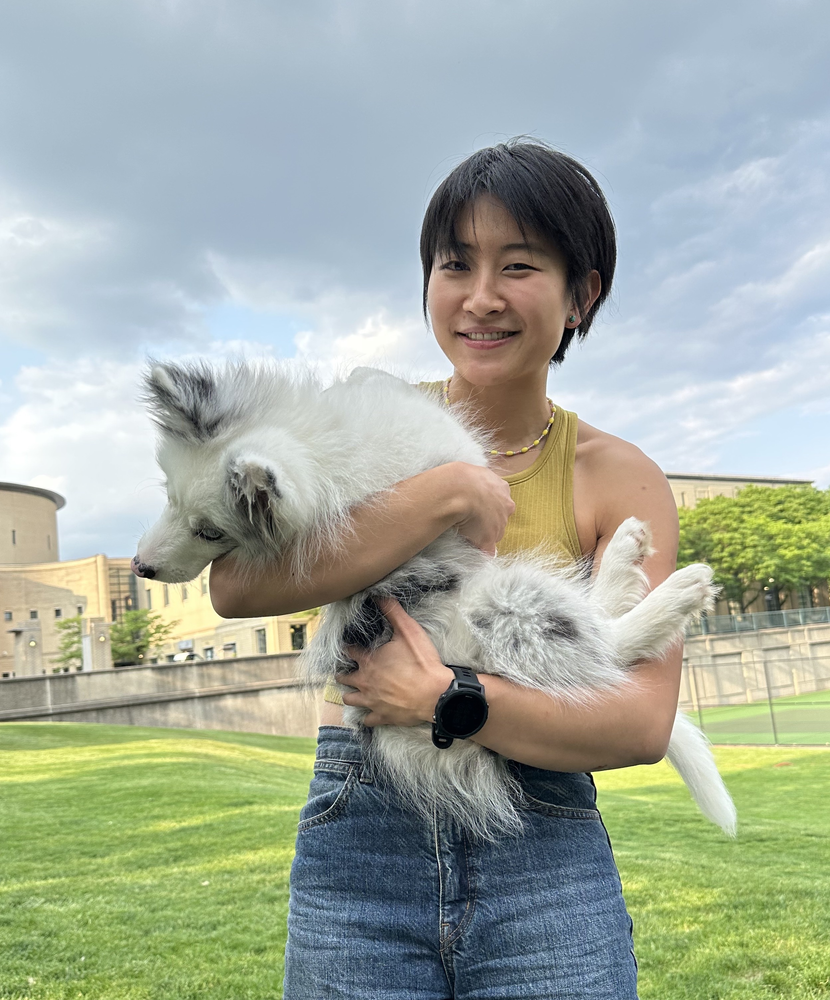

<a title="Email" class="icon-link" href="mailto:ariayuanwang@gmail.com"><svg>
    <!-- mail icon -->
    <path stroke="none" d="M0 0h24v24H0z"/>
    <rect x="3" y="5" width="18" height="14" rx="2" />
    <polyline points="3 7 12 13 21 7" />
</svg></a><a title="GitHub" class="icon-link" href="https://www.github.com/ariaaay"><svg>
    <!-- github icon -->
    <path stroke="none" d="M0 0h24v24H0z"/>
    <path d="M9 19c-4.286 1.35-4.286-2.55-6-3m12 5v-3.5c0-1 .099-1.405-.5-2 2.791-.3 5.5-1.366 5.5-6.04a4.567 4.567 0 0 0 -1.333 -3.21 4.192 4.192 0 00-.08-3.227s-1.05-.3-3.476 1.267a12.334 12.334 0 0 0 -6.222 0C6.462 2.723 5.413 3.023 5.413 3.023a4.192 4.192 0 0 0 -.08 3.227A4.566 4.566 0 004 9.486c0 4.64 2.709 5.68 5.5 6.014-.591.589-.56 1.183-.5 2V21" />
</svg></a><a title="Google Scholar" class="icon-link" href="https://scholar.google.com/citations?user=MepHbYgAAAAJ&hl=en"><svg>
    <!-- google icon -->
    <path stroke="none" d="M0 0h24v24H0z"/>
    <path d="M17.788 5.108A9 9 0 1021 12h-8" />
</svg></a><a title="Twitter" class="icon-link" href="https://twitter.com/ariairaw"><svg>
    <!-- twitter icon -->
    <path stroke="none" d="M0 0h24v24H0z"/>
    <path d="M22 4.01c-1 .49-1.98.689-3 .99-1.121-1.265-2.783-1.335-4.38-.737S11.977 6.323 12 8v1c-3.245.083-6.135-1.395-8-4 0 0-4.182 7.433 4 11-1.872 1.247-3.739 2.088-6 2 3.308 1.803 6.913 2.423 10.034 1.517 3.58-1.04 6.522-3.723 7.651-7.742a13.84 13.84 0 0 0 .497 -3.753C20.18 7.773 21.692 5.25 22 4.009z" />
</svg></a>

I am currently a research scientist in the [Machine Learning Team](https://cmn.nimh.nih.gov/mlt) at NIH/NIMH, where I collaborate with experimentalists across a wide range of fields to build computational models to explain neural data. My primary research interest is driven by developing models to understand computations carried out the brain. I am particularly passionate about the future of integrating end-to-end task-driven learning on neural data with both behavioral and neuronal interventions, aiming to uncover specific mechanisms and objectives in neural processings.

Prior to NIH, I received my joint PhD in [Neural Computation](http://compneuro.cmu.edu/) and [Machine Learning](https://www.ml.cmu.edu/) at Carnegie Mellon University, where I had the privilege of being advised by by [Mike Tarr](https://sites.google.com/andrew.cmu.edu/tarrlab/) and [Leila Wehbe](https://www.cs.cmu.edu/~lwehbe/). My PhD works have focused on modeling visual and semantic processing in the human brain, where I collected data using functional Magnetic Resonance Imaging (fMRI) and used models from computer vision and natural language processing to model brain responses of viewing natural images and movies. 

Before CMU, I received a B.A. in Statistics and Cognitive Science from UC Berkeley.

Other than research, I enjoy bouldering, mountaineering, cooking, and reading.

# Publications and Preprints {-}


# Conference and Workshop Presentations {-}


<!-- # Projects {-}
 -->
